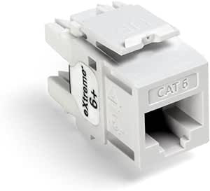
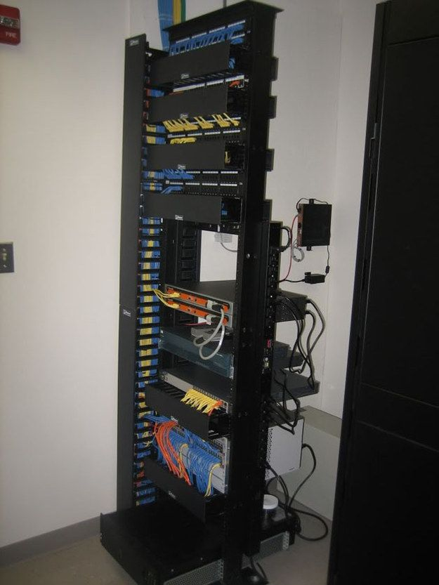
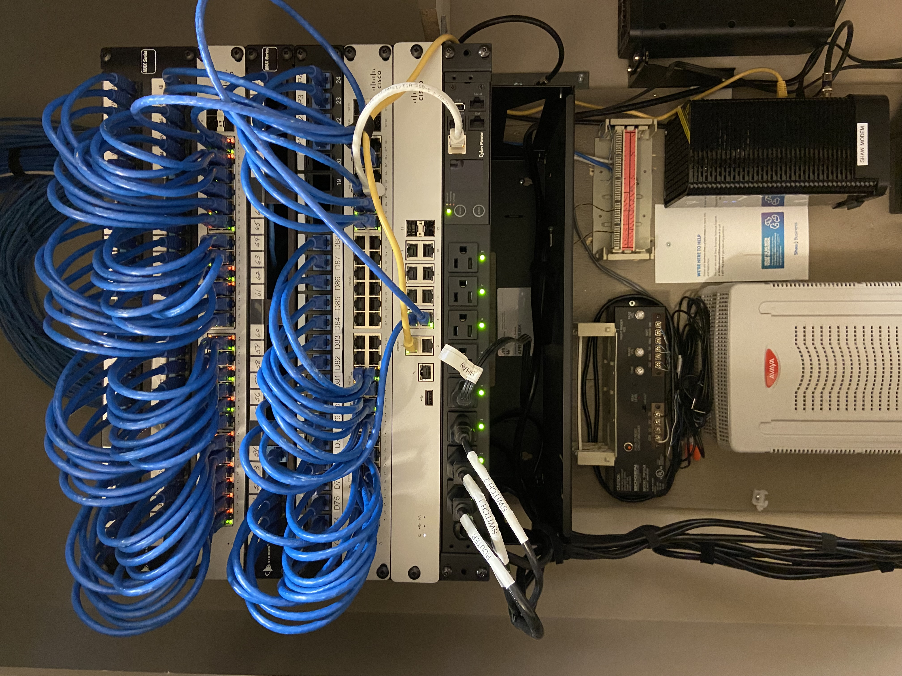

# VCA Canada Cabling Requirements

## Wiring

All cabling should be CAT 5e or better. Any new installations should use CAT 6 or better.

## Terminations

All terminations should use RJ45 keystone jacks (i.e. not RJ45 crystals). On the network switch end, we require a patch panel. Existing patch panels or keystone jacks must be CAT 5e or better and new installations should be CAT 6 or better.

## Rack Requirements

### Less than 96 terminations

In these cases, we prefer to use a network wall rack. Our standard rack offers eight racking units (8U) of space while also providing a shelf at the bottom.

Here is a link to the standard rack:

https://www.startech.com/en-ca/server-management/wallshelf8u

SKU: `WALLSHELF8U`

### More than 96 terminations

We prefer to use a 2-post rack with the base bolted to the floor. Please also use a cable tray overhead to keep the cabling clean.

Here is an example of a two-post rack installation. 

## Patch Panel Spacing

On all of our network racks, we want our patch panels located at the top of the rack. We follow a pattern like:

|Network rack|
|---|
|2U Patch Panel|
|1U 48 Port Switch|
|2U Patch Panel|
|1U Switch|
|...etc...|

Here is an example photo from one of our locations:

