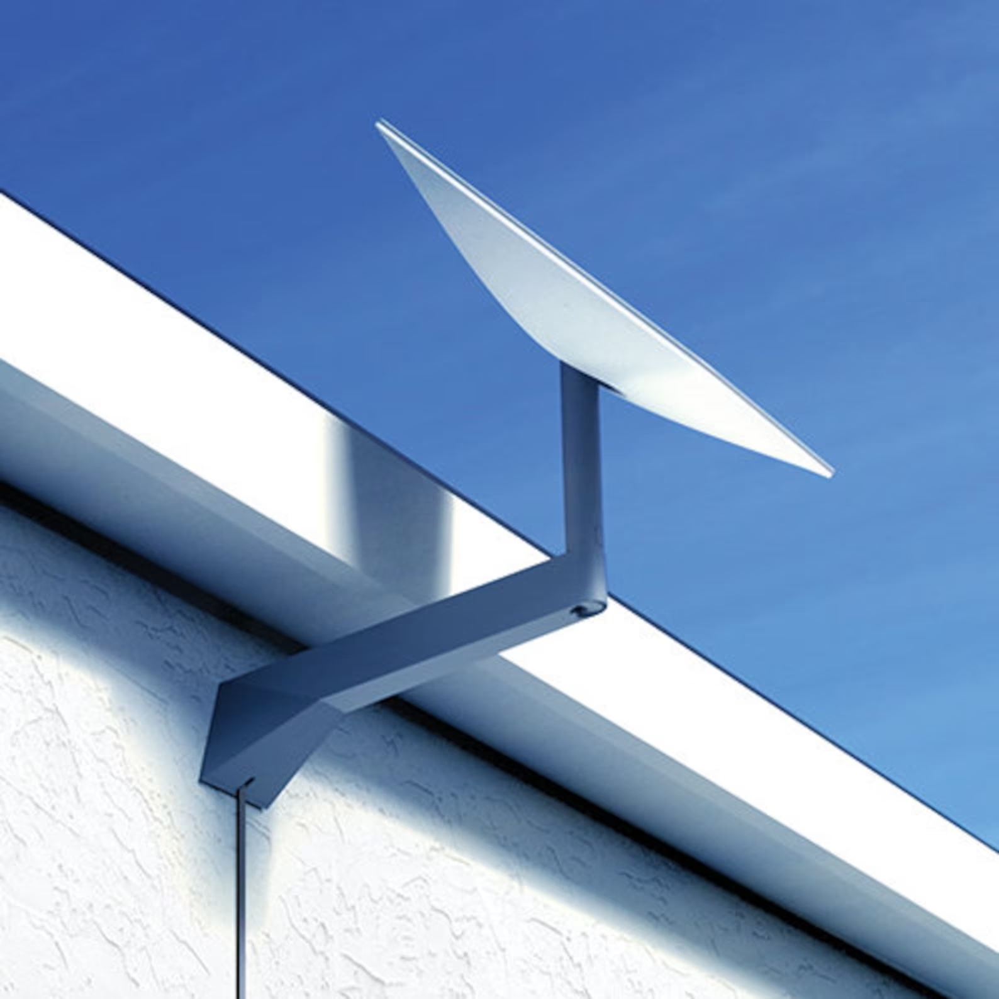
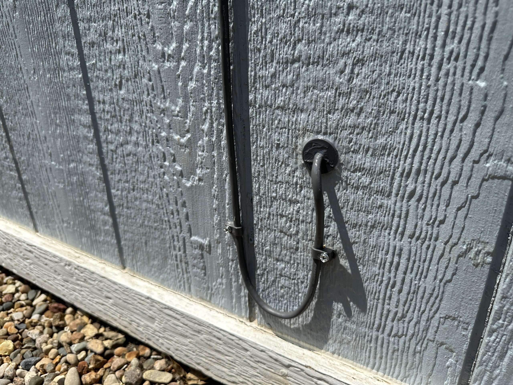
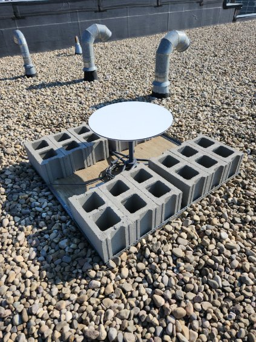
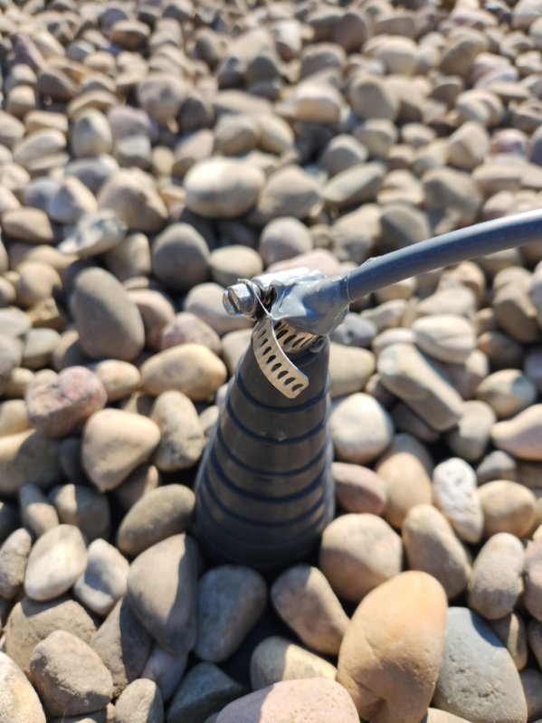

# Starlink Installation/Setup

## Hardware Install - Exterior

The Starlink dish is designed to be mounted outdoors in an area with a clear view of the sky, and no obstructions nearby. The Starlink stand has bolt holes to accommodate securely attaching it to a surface, we will use those in the following base setup.

Here are the four installation types. We typically try the exterior wall and then a roof installation if the wall cannot work. 

### Exterior Wall

For exterior wall installations (brick, stucco, siding), the following method may be used:

We fasten the Starlink long-arm mount to the wall and make one puncture point to feed the Starlink cable. Photo for reference:

We use a masonary kit (or landlord may provide one) to seal the cable insertion point along the wall. We aim to keep the installation as minimal as possible. Photo for reference:

### Flat Roof

For installations on a flat (gravel or asphalt) roof, the following method may be used.

#### Materials

- 4 x 4-ft (approximate) sheet of plywood
- Concrete cinder blocks
- Stand mounting hardware (bolts, nuts, washers as needed)

#### Install

1. Mount the Starlink stand to the plywood in a manner suitable for the location.
2. Place the cinder blocks on the plywood to hold to down securely. In our previous setups, 12 cinder blocks was sufficient to securely hold the dish in place.

#### Routing the Cable

A hole through the roof or side of the structure will be required to get the signal from the Starlink to the networking hardware indoors. Use suitable conduit and waterproofing methods to achieve this.

**IMPORTANT:** Approval from the property landlord **must** be received prior to creating any punctures/holes through the structure. Consult with the hospital manager on how to contact the landlord and request that approval.

Often times, the landlord may require their vendor to drill the hole and you will seal it.

### Pitched Roof

For installation on a sloped roof, an adapter can be purchased to accommodate a sloped roof. Contact VCAC IT for assistance.

### Pole-Mount

If installation on a roof is not feasible, the Starlink dish can be installed on a pole-mount. Contact VCAC IT for assistance with ordering the appropriate adapter.

---

## Hardware Install - Interior

### Routing the Cable Indoors

The cable has a **non-detachable** connector that is fairly large, take care when routing this cable as the connector can be easily damaged. If the included cable is not long enough to reach from the dish installation point to the networking room, a longer cable can be purchased (75-ft cable is standard, a 150-ft cable is available).

### Setting up the Starlink Router

The Starlink router will require an ethernet adapter (gen 2. kits only. Gen. 1 & gen. 3 kits do not need the adapter); this adapter will be included in the package if needed.

1. Plug the cable from the dish into the Starlink router and plug it into power. Ensure that the power for the router is connected into the PDU (power delivery unit), contact VCAC IT for assistance if required.
2. Allow the dish and router to power up, this may take a few minutes.

### Configuring the dish via the Starlink app

The dish will likely come pre-configured so this step may not be required. A note will be included inside the kit stating so. If it is not pre-configured, contact VCAC IT for assistance.

### Connecting the Starlink Router to the MX84/MX85

1. Once the dish and Starlink router have been powered on, connect an Ethernet cable from the Starlink router into either **Internet 1** or **Internet 2** on the Cisco MX84/85.
2. Contact VCAC IT for final configuration.

Note: On the MX84 models, these ports are labelled as ports 1 & 2. On the MX85 models label these connections as ports 3 & 4.

---

## Contacting VCAC IT

If you have questions about the installation process, please contact VCAC IT using the contact information included with the Starlink kit. If you are onsite and need immediate support, please contact your supervisior or speak with the hospital manager onsite to get in contact with VCAC IT via telephone. For privacy, the direct phone number is not published and should not be provided to clinic staff.
