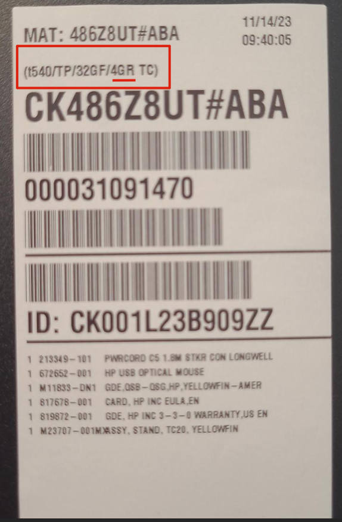

# VCA Canada Enable PXE for ThinStation on HP T530

## Objective

These instructions will show you how to disable SATA booting and enable PXE booting. 

## Print off Thin Client label

Before you PXE enable the thin client, you need to print off the label for the thin client. We use 2" by 4" labels. You can use [this link](https://thinstation-inventory.vcacanada.com/) to access the label generator.

## PXE enable Thin Client

After 15-20 seconds the Smartsheet is saved, our DHCP server is automatically updated, so we're ready to PXE enable the thin client. After this is complete, it should load up ThinStation, our Linux OS.

* Reboot thin client, and keep pressing F10 until you end up in the HP Setup Utility
* Choose Security -> Device Security
  * Set "SATA0" to "Device hidden" with the arrow keys
  * Press F10 to save
* Choose Security -> Secure Boot Configuration
  * Press F10 to continue
  * Set "Legacy Support" to "Enable"
  * Set "Secure Boot" to "Disable"
  * Press F10 to save
* Choose Storage -> Boot Order
  * Use arrow keys to select "Network Controller" under the "Legacy Boot Sources" header.
  * Press enter to 'drag', then use the arrow keys to move it to the top of the "Legacy Boot Sources" list, then press enter to 'drop'
  * Press F10 to save
* Choose File -> Save Changes and Exit (say yes you're sure when prompted)

## Notes

## IMPORTANT NOTE ABOUT T530/T540 4GB RAM MODELS

If the thin client has 4GB of RAM, the following **MUST** also be performed in addition to the above steps or else the thin client **WILL NOT WORK**

* Reboot thin client, and keep pressing F10 until you end up in the HP Setup Utility
* Navigate to Advanced -> Device Options
  * Set "Integrated Graphics" to **Force**
  * Set "UMA Frame Buffer Size" to **256MB**
  * Press "F10" to accept
* Choose File -> Save Changes and Exit (say yes you're sure when prompted)

### How to Identify the 4GB Models

On the thin client box, there will be a label that states the model as `t540/TP/32GF/4GR TC` where `4GR` indicates that it has 4GB of RAM.

  * The info label provided inside the packaging contains the same model designation. 
  * If the packaging is not present, remove the side panel on the thin client to find the same information printed nearby the MAC address and regulatory labels.

Sample photo:

### T540 note

For T540's, we support using UEFI, so you do NOT need to enable legacy support, but secure boot does need to be disabled. The boot order also needs to favor UEFI over legacy options. 
