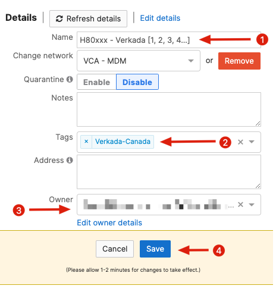

# Enroll the iPad

- Sign into the Apple `Automated Deployment Enrollment (ADE)` platform for VCA and register the iPad serial number (if not already completed)

## Configure the iPad in Meraki

1. Sign into the Meraki dashboard and switch to the `VCA - MDM` network
2. Locate the device by navigating to `System Manager > Devices` and searching for it by serial number
3. Select `Edit details`
   1. Give the iPad a name matching the format of `H80xxx - Verkada [1,2,3...]` ; number it sequentially if there are mutliple Verkada iPads, ensure the hosiptal AU number is filled in
   2. Remove the default `meraki-production` tag
   3. Add the `Veraka-Canada` tag
   4. Ensure the `Owner` is set to `vcamobiletablet` (It should be by default)
   5. Click `Save`

---

### Verkada Command

- If the iPad is being setup for use as an administration device for the Verkada network, include the `Verkada Command` app by adding the `Verkada-Command-Canada` tag in addition to the tags previously (this is not normally needed)

---

## Configure the iPad on Device

1. Power on the iPad and connect it to a WiFi network (`VCAC-Guest` works well for this)
2. Follow through the initial setup prompts; **do not sign it into an Apple ID if prompted**
3. Allow the iPad to synchronize with Meraki; this can take some time
4. The wallpaper will change and the Verkada apps will get installed; the home screen layout will also change
5. Remove the `VCAC-Guest` WiFi by navigating to `Settings > WiFi` and selecting the blue `i` adjacent to the `VCAC-Guest` network name; select `Forget this Network`
